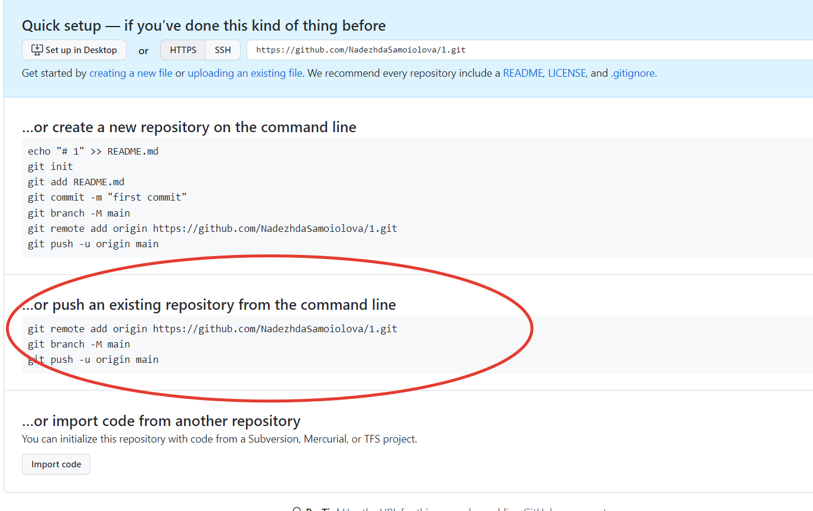

# Инструкция по работе с программой git

## Оглавление 

 1. [Основные понятия](#часть-1-основные-понятия)
 2. [Начало работы с git](#часть-2-начало-работы-с-git)
 3. [Добавление файла и сохранение изменений в нем](#часть-3-добавление-файла-и-сохранение-изменений-в-нем)
 4. [Переименование файла](#часть-4-переименование-файла)
 5. [Переименование комментария к коммиту](#часть-5-переименование-комментария-к-коммиту)
 6. [Просмотр изменений и перемещение между версиями файла](#часть-6-просмотр-изменений-и-перемещение-между-версиями-файла)
 7. [Прочие удобные команды](#часть-7-прочие-удобные-команды)
 8. [Работа с ветками](#часть-8-работа-с-ветками)
 9. [Git Hub](#часть-9-работа-с-git-hub)

 ## Часть 1. Основные понятия

Что такое **git** и зачем она нужна? 

Программа git фиксирует изменения, которые были в файле, сохраняет верисси файла и позволяет перемещаться между разными версиями файла. В отличии от стандартных программ, которые сохраняют новый документ полностью, программа git запоминает лишь предпринятые изменения файла, что в значительной степени экономит место памяти компьютера. При работе с большими объемами данных это крайне важная особенность, позволяющая экономить ресурсы на обработку и хранение инофрмации. 

**Репозиторий** - это *пространство*, которое активно используется в работе. Это пространство организовано в виде *папки* и содержит файлы, которые остлеживаются программой git. Все файлы, которые находятся в данной папке (в данном пространстве), отлеживаются программой git. 

Вопрос: Любая ли папка может быть репозиторием? 

Ответ: Нет, не любая, а только та, которая отслеживается программой git. 

**Проводник** - Поле слева, в котором отражается папки и файлы репозитория

**Терминал** - поле для ввода команд 

## Часть 2. Начало работы с git
Перед началом работы нужно удоствериться, что git установлен и работает корректно. Для этого вызываем первую команду:

* **git version** - показывает версию git

*Если git не распознан - это значит, что visual studio code не в курсе, что git установлен. Что делать? - Перезайти в visual studio code.*

Итак, мы видим, что git установлен, видим его версию. 

Для того, чтобы программа git могла сохранять изменения, ей необходимо знать, кто эти изменения производит. Для этого необходимо "представиться" программе. Это нужно сделать только один раз, программа запомнит кто с ней работает и больше не будет просить об этом. Для этого нужно выполнить следующие команды: 

* **git config --global user.email** "*адрес электронной почты*"
* **git config --global user.name** "*Имя пользователя*"

Далее нужно удостовериться, что git расположен в нужной нам папке. Для этого делаем следующую команду:

* **git init**

*Данную команду следует делать только один раз для папки, которую мы хотим сделать репозиторием. После введения данной команды git там уже будет работать. После инициализации в папке-репозитории появится скрытая папка .git. Ее увидеть можно нажав на галочку "отображать скрытые элемены" в строке "вид" в непосредственно в папке.*

## Часть 3.  Добавление файла и сохранение изменений в нем

Итак, мы убедились, что git расположен в нужной нам папке. Следующим шагом добавим файл, в котором и будем далее работать. Создаем файл в левом поле под названием "Проводник". !!! Файл нужно называть одним словом без пробелов и указываем расширение!!! Например, "GitInstruckton.md".

Возле названия файла справа от папки появилась буква U. Это **Статус** файла. Статусы бывают следующие: 

**U** - untrackt - неотслеживаемый. Данный статус означает, что файл существует, но git не знает, что в нем происходит. 

**А** - added - добавлен. Файл добавлен, но изменения в нем не зафиксированы. Файл приобретает данный статус, после выполения команды 

* **git add** название файла (можно нажатием кнопки Tab выбрать нужный файл). 

**М** - modified - изменения сохранены. Данный стутус приобретается после выполения команды: 

* **git commit -m "*название файла*"**

Также при вводе иноформации в поле редактирования документа можно наблюдать **белую жирную точку** возле названия файла вверху страницы. Этот символ означает, что изменения не сохранены в документе. Для сохранения изменений нужно набрать на клавиатуре CTRL S.  

Если никаких букв и точек не высвечивается, то все изменения сохранены и, говоря на профессиональном языке, *"закоммичены"*. 

## Часть 4. Переименование файла
Переименование файла git воспринимает так, что прежний файл был удален. Поэтому такой порядок действий:

* **git add "*старое имя файла*"**
* **git add "*новое имя файла*"**
* **git commit -m"*название вносимого изменения*"**

## Часть 5. Переименование комментария к коммиту
Если получилась ошибка в назавнии коммита, необходимо ввести следующую команду: 

* **git commit --amend-m "*правильное название файла*"**

*такимо способом возможно поменять только последний коммит*

## Часть 6. Просмотр изменений и перемещение между версиями файла

Для того, чтобы посмотреть, какие версии файла существуют, нужно набрать команду 

* **git log** 

*В названии версии файла отобразится код коммита, автор изменения и его контакт (почта), а также время изменений*

Для того, чтобы зайти в версию файла с нужными изменениями, нужно ввести команду

* **git checkout "*имя коммита - достаточно первые 4 символа имени*"**

Для того, чтобы вернуться в актуальную версию, нужно ввести команду

* **git checkout master**

## Часть 7. Прочие удобные команды

**cd** - команда, чтобы изменить папку (директорию)

     варианты: cd - возвращает в основную папку
               cd "*имя папки*" - возвращает в ту папку, которая нужна

**clear** - удаляет ненужные команды, чтобы они не закрывали поле терминала

стрелки вверх и вниз подствечивают команды, которые уже задавались в терминале

**git add звездочка** - добавляет все файлы

**git --help** - выдает все возможные команды (может быть полезно, если вы забыли как конкретно пишется та или иная команда или просто не знаете, какую команду ввести для нужного действия)

**q** - возвращает курсор в терминале в состояние, готовое для восприятия команд

**git dif** - определяет построчную разницу между файлами

**git status** - показывает статус документа, в какой ветке находимся, есть ли незафиксированные изменения в документе

## Часть 8. Работа с ветками
### [8.1. Понятие ветвлений. Где мы?](#понятие-ветвлений-где-мы) 
### [8.2. Создание новой ветки](#создание-новой-ветки)
### [8.3. Перемещение между ветками](#перемещение-между-ветками)
### [8.4. Слияние веток](#слияние-веток)
### [8.5. Графическое представление ветвлений](#графическое-представление-ветвлений)

### __Понятие ветвлений. Где мы__

Ветвления (ветки, branches) - это черновики нашего документа. Мы можем работать с отдельными частями документа, делегировать работу разным людям, а затем производить слияние этих версий в одну. 

Чтобы понять, на какой ветке мы сейчас находимся, нужно использовать команду 

* **git branch**

### __Создание новой ветки__
Для того, чтобы создать новую ветку, нужно ввести команду

* **git branch** *name of new branch*

Работа в разных ветках позволяет работать над разными частями документа разным людям

### __Перемещение между ветками__
Для того, чтобы перемещаться между ветками, нужно ввести команду 

* **git checkout** *name of branch you wish*

### __Слияние веток__
Для того, чтобы слить ветки, нужно выйти в основную ветку и выполнить команду 

* **git merge** *name of the branch you want to merge*

### __Графическое представление ветвлений__
Для того, чтобы увидеть процесс создания и слияния веток  графически, нужно выполнить команду

** *git log --graph**

## Часть 9. Работа с Git Hub
### [9.1. Общая информация о Git Hub](#общая-информация-о-git-hub)
### 9.2. Создание репозитория на Git Hub
### 9.3. Внесение изменений в локальный репозиторий
### 9.4. Внесение изменений в удаленном репозитории
### 9.5. Запрос на принятие изменений

### **Общая информация о Git Hub**

Git Hub позволяет работать с репозиториями удаленно. Есть возможность работать нескольким людям над разными частями проекта, отправлять запросы на принятие вносимых изменений лидеру команды. 

### **Создание репозитория на Git Hub**

Итак, прежде всего нужно авторизироваться на Git Hub. 

Для того, чтобы создать Репозиторий на Git Hub нужно выполнить следующие шаги
1) создаете репозиторий на компьюете, как обычно, выполняя команды для инициализации репозитория, первый коммит. 
2) открываете сервер Git Hub, нажимаете кнопку для создания репозитория (new - во вкладке Репозитории или + в правом верхнем углу)
3) в открывшемся окне - задаете имя репозитория, ставите галочку public и нажимаете кнопку "создать". 
4) в появившемся окне нужно выбрать второй вариант, как показано на картинке ниже: 

... и прописать указанные в этом варианте команды: 

* **git remote add origin** *Adress*  - добавляет локальный файл

* **git branch -M** *name of the main branch* - указывает, какая ветка будет основной

* **git push -u origin** *name of branch* - заливает файл на сервер Git Hub
